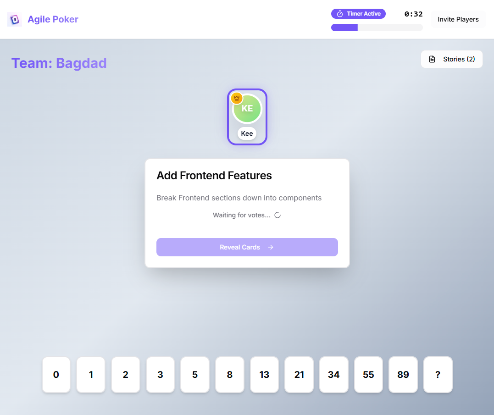
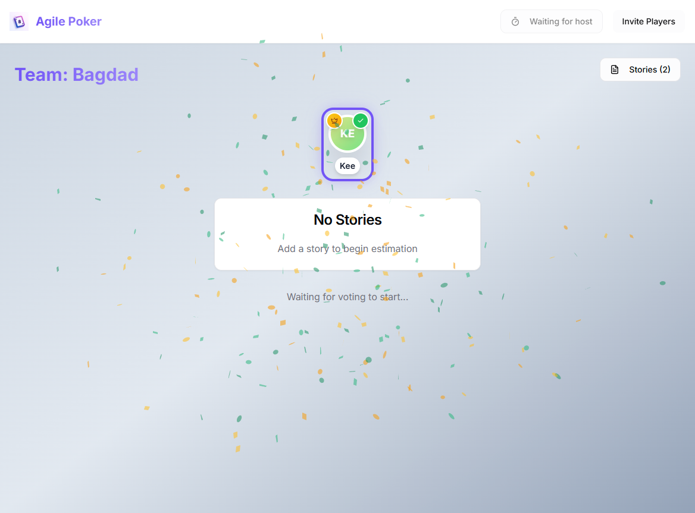

# 🃏 Agile Poker Planning

A real-time collaborative estimation tool for remote agile teams. Multiple team members can join a session, vote simultaneously, and reveal estimates together — all synchronized instantly across browsers.

**[Live Demo](https://www.agilepoker.darrinduncan.com/)** | **[Portfolio](https://darrinduncan.com)**





## What It Does

Agile Poker digitizes the Planning Poker estimation technique used by software teams during sprint planning. Team members independently estimate the effort for user stories, then reveal their votes simultaneously to avoid anchoring bias and encourage discussion.

**Key Features:**
- **Real-time synchronization** — All actions (voting, reveals, timer) sync instantly across all participants
- **Private voting** — Estimates remain hidden until the host reveals, preventing groupthink
- **Session management** — Create rooms, invite via shareable links, manage multiple stories
- **Countdown timer** — Optional time pressure with auto-reveal when time expires
- **Consensus detection** — Visual celebration when the team reaches agreement

## Built With

**Core Stack:**
- React 18 with TypeScript
- Vite for build tooling
- Tailwind CSS for styling

**Real-Time & Data:**
- **Supabase** — PostgreSQL database with real-time subscriptions via `postgres_changes`
- **React Context** — Centralized game state management across components

**UI & Animation:**
- **shadcn/ui** — Accessible component primitives built on Radix UI
- **Framer Motion** — Smooth card flip and transition animations
- **canvas-confetti** — Celebration effects when team reaches consensus

## 💡 Technical Highlights

**What makes this project technically interesting:**

1. **Real-Time State Synchronization**
   Uses Supabase Realtime to subscribe to `postgres_changes` events. When any user votes or the host reveals cards, database changes trigger instant updates across all connected clients — no polling required.

2. **Optimistic UI with Database Truth**
   Local state updates immediately for responsiveness, while Supabase serves as the single source of truth. Reconnecting users automatically sync to the current game state.

3. **Distributed Timer Coordination**
   Timer state is stored as an end timestamp in the database, not a countdown. Each client calculates remaining time locally, ensuring all users see synchronized countdowns regardless of when they joined.

4. **Session Persistence Without Authentication**
   Games persist in the database indefinitely. Players reconnect using localStorage-stored IDs, eliminating signup friction while maintaining session continuity.

5. **Consensus Detection & Broadcast**
   On reveal, the app calculates vote agreement percentage and broadcasts confetti events via Supabase Realtime channels to all clients simultaneously.

## 🚀 Getting Started

### Prerequisites
- Node.js 18+
- Supabase account (or compatible PostgreSQL with realtime)

### Installation

```bash
# Clone the repository
git clone https://github.com/darrinduncan/agile-poker.git

# Navigate to project directory
cd agile-poker

# Install dependencies
npm install

# Set up environment variables
cp .env.example .env
# Add your Supabase URL and anon key to .env

# Run development server
npm run dev
```

The app will open at `http://localhost:5173`

### Environment Variables

```
VITE_SUPABASE_URL=your_supabase_project_url
VITE_SUPABASE_PUBLISHABLE_KEY=your_supabase_anon_key
```

## How It Works

1. **Create a Session** — Host enters a game name and display name
2. **Invite Team** — Share the auto-generated 6-character invite link
3. **Add Stories** — Host adds user stories to estimate
4. **Vote** — Each participant selects a card value privately
5. **Reveal** — Host reveals all cards simultaneously (or timer auto-reveals)
6. **Discuss & Finalize** — Team discusses differences, host records final estimate
7. **Repeat** — Move to next story

## What I Learned

Building a real-time collaborative application taught me the nuances of distributed state management. Ensuring all clients stay synchronized — especially handling edge cases like users joining mid-vote or refreshing during a reveal — required thinking carefully about where truth lives (database) versus what's derived (UI state). The timer synchronization problem was particularly interesting: storing timestamps rather than countdowns elegantly handles clients joining at different times.

## 🔮 Future Enhancements

- [ ] Self-hosted PostgreSQL option (currently Supabase-dependent)
- [ ] Voting history and session analytics
- [ ] Custom card value sequences (T-shirt sizes, custom Fibonacci)
- [ ] Spectator mode for non-voting participants
- [ ] Export results to CSV/Jira integration

## 📝 License

MIT License — feel free to use this project for learning.

## 🤝 Connect

Built by **Darrin Duncan** — Frontend Developer with 15+ years of experience

- 🌐 Portfolio: [darrinduncan.com](https://darrinduncan.com)
- 💼 LinkedIn: [linkedin.com/in/darrinduncan](https://linkedin.com/in/darrinduncan)
- 📧 Email: darrin@darrinduncan.com

---

⭐ If you found this project helpful, consider giving it a star!
